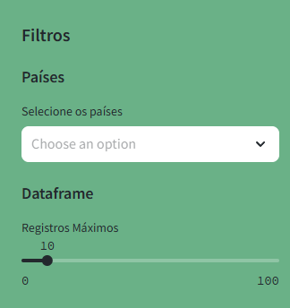

# Analise de dados para vaga de estágio KoreData

## Introdução

Para esta análise de dados, utilizei a base de dados disponível no link [Online Retail Dataset](https://archive.ics.uci.edu/dataset/352/online+retail). Esta base contém transações de uma loja online do Reino Unido, registradas entre 01/12/2010 e 09/12/2011.

### Instalação e preparação do ambiente

Para realizar a análise de dados, é necessário instalar algumas bibliotecas adicionais. Execute os seguintes comandos para instalar o PostgreSQL, psycopg2, pandas, Streamlit, Matplotlib e NumPy:

```bash

# Instale o PostgreSQL
sudo apt-get install postgresql postgresql-client

# Instale o psycopg2
pip install psycopg2-binary

# Instale o pandas
pip install pandas

# Instale o Streamlit
pip install streamlit

# Instale o Matplotlib
pip install matplotlib

# Instale o NumPy
pip install numpy
```

## Automatização

Para automatizar o processo de pré-processamento dos dados, criação do banco de dados `online_retail`, da tabela `invoices` e inserção dos dados processados no banco, foram criados dois scripts: um para Linux (`auto.sh`) e outro para Windows (`auto.bat`). Esses scripts realizam as etapas necessárias para preparar o ambiente e carregar os dados no banco de dados.
Para executar, basta abrir o terminal no diretório principal e executtar o comando abaixo:

```bash
.\auto.bat
```

## Pré-processamento


O código carrega os dados a partir de um arquivo Excel (`Online Retail.xlsx`) para um DataFrame `df`.   
- As colunas de tipo `object` são convertidas para o tipo `string`, padronizando o formato textual dos dados.
- A coluna `InvoiceDate` é transformada para um formato de data.
- Uma coluna `TotalPrice` é criada, calculando o preço total para cada transação como o produto entre `UnitPrice` e `Quantity`.
- A coluna `CustomerID` é convertida para um tipo `string`, após garantir que valores nulos sejam representados corretamente.

O dicionário `stock_dict` armazena uma relação entre códigos de estoque (`StockCode`) e descrições de produtos (`Description`). Caso uma linha não contenha uma descrição, o código busca a última descrição válida para o mesmo código de estoque, garantindo consistência nas descrições.

Um novo DataFrame `dfnew` é criado como uma cópia de `df`. A coluna `Description` é atualizada com base nas informações de `stock_dict`, substituindo valores ausentes com as descrições correspondentes. O DataFrame final é então exportado para um arquivo CSV (`processada.csv`).

## Dashboard Interativa com Streamlit

Para facilitar a visualização e análise dos dados, foi desenvolvida uma dashboard interativa utilizando a biblioteca Streamlit. Para executar a dashboard, utilize o comando abaixo no terminal:

```bash
streamlit run dashboard.py
```
Certifique-se de estar no diretório onde o arquivo `dashboard.py` está localizado. A aplicação será aberta em seu navegador padrão, permitindo a interação com os dados.

#### Filtros Disponíveis:
1. **Seleção de Países**: Permite selecionar um ou mais países para filtrar os dados exibidos.
2. **Máximo de registros por Exibição**: Define o número máximo de registros a serem exibidos em cada visualização.



### Indicadores Utilizados na Dashboard

A dashboard apresenta os seguintes indicadores:

#### Indicadores de Vendas:
1. **Receita Total**: Valor total das vendas realizadas.
2. **Receita Diária/Mensal**: Receita acumulada por dia e por mês.
3. **Receita por País**: Receita gerada por cada país.

#### Indicadores de Clientes:
1. **Clientes Únicos**: Número de clientes distintos.
2. **Top Clientes**: Clientes que mais contribuíram para a receita.
3. **Frequência de Compras por Cliente**: Número médio de compras por cliente.

#### Indicadores de Produtos:
1. **Produtos Mais Vendidos**: Produtos com maior quantidade vendida.
2. **Produtos com Melhor Desempenho por Categoria**: Produtos que geraram maior receita em cada categoria.
3. **Produtos Mais Devolvidos**: Produtos com maior número de devoluções.

#### Indicadores de Transações:
1. **Número de Transações**: Total de transações realizadas.
2. **Transações com Devoluções**: Transações que incluíram devoluções.
3. **Ticket Médio**: Valor médio por transação.

#### Análise Temporal:
1. **Variação Sazonal nas Vendas**: Análise das variações sazonais nas vendas.
2. **Tendência de Vendas ao Longo do Tempo**: Tendência das vendas ao longo do período analisado.

A dashboard foi projetada para ser intuitiva e fácil de usar, permitindo que os usuários filtrem e explorem os dados conforme necessário para obter insights valiosos.

### ANOTAÇOES

Descontos e devoluções não foram possiveis ser contabilizadas devido a não possuirem preço de devolução, o que pode ser realizado é um tratamento de busca no pré processamen
Consultas diretas no SQL com a dah tem um
tempo de espera muito grande